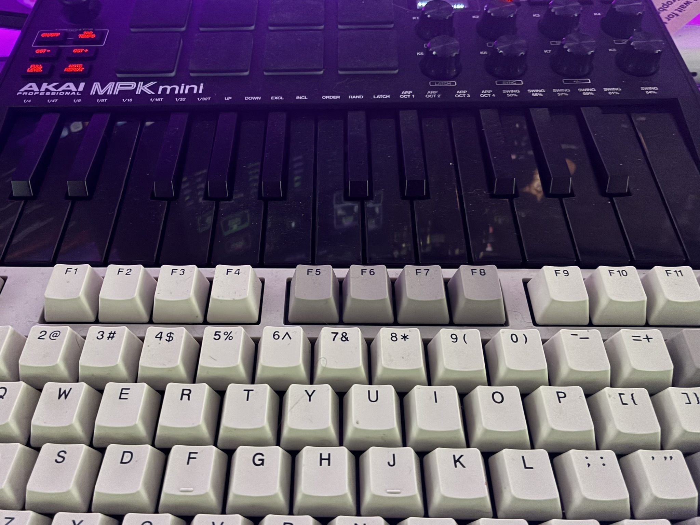
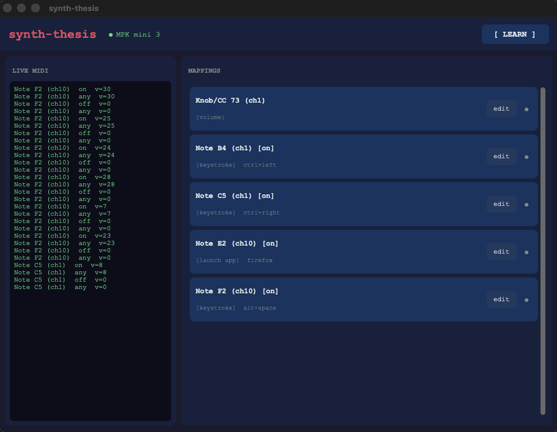

# synth-thesis devlog

A running log of how this got built, the decisions made, and the things that broke.

---

## The idea

I have a midi synth that's been collecting dust ever since I realize I have no musical talent :). I thought I could make it into a homebrew Stream Deck to control volume with a knob, use pads to launch apps, and keys for various macros. I didn't write any of the code myself - I'm not a programmer - but Claude got us there pretty quickly.

Claude's summary:

## Stack

**Python**, because the MIDI, GUI, and macOS system control libraries are all solid there and it's fast to iterate.

- `python-rtmidi` — CoreMIDI bindings. Detects the MPK mini immediately, runs a polling loop in a background thread.
- `customtkinter` — modern dark-themed GUI built on tkinter. Courier New monospace throughout for the aesthetic.
- `pynput` — keyboard simulation. Used for both keystroke actions and volume key presses.
- `subprocess` / `osascript` — app launching and AppleScript execution.

Python 3.14 from Homebrew doesn't ship with tkinter by default, so `brew install python-tk@3.14` was a necessary detour.

---

## Architecture

Three layers:

**`midi_listener.py`** — runs a background thread, polls `rtmidi` for messages, decodes status bytes into typed events (`note`, `cc`, `pitchwheel`), fires callbacks. Notes get dispatched as both `on`/`off` and `any` trigger variants so a single physical press can match multiple bindings. Device connect/disconnect is detected in the same loop.

**`config.py`** — flat JSON mapping keyed by `{type}:{channel}:{number}:{trigger}`. Simple dataclasses for `Mapping` and `Action`. Load/save on every change.

**`actions.py`** — executes actions by type. Runs in a daemon thread so MIDI callback returns immediately. Supports six action types with a `{value}`/`{pct}` substitution system for passing live knob data into shell commands and AppleScript.

The GUI (`gui.py`) owns the `mappings` dict, passes it by reference to the listener, and mutates it in place on save — so live bindings update without restarting anything.

---

## Learn mode

The configuration UX is the core of the thing. Rather than asking you to look up note numbers or CC IDs, you click **[ LEARN ]**, press whatever you want to bind, and a dialog opens pre-filled with what was just received. Trigger selector, action type dropdown, value field, save. That's it.

The learn intercept sits in `_on_midi` — if `_learn_pending` is set, the next non-zero MIDI event captures to a dialog and clears the flag. Notes and CC events both work. Pitch wheel too, though it's less useful as a trigger.

---

## The daemon split

Early on, mappings only fired when the GUI was open. That was obviously wrong for anything you actually want to rely on. The fix was splitting the listener into a headless `synthd.py` that reads `mappings.json`, runs the listener loop, and hot-reloads the file whenever it changes (1-second mtime poll). The GUI became a pure config tool — it writes JSON, the daemon picks it up.

`synthd.py` runs as a LaunchAgent (`~/Library/LaunchAgents/com.allie.synth-thesis.plist`), which means it starts at login, restarts on crash, and runs without a terminal. Logs go to `~/Library/Logs/synth-thesis.log`.

---

## Volume control: three wrong turns

**Attempt 1**: AppleScript. `set volume output volume {pct}` where pct is CC 0–127 scaled to 0–100. Works, but doesn't trigger the macOS volume HUD. No visual feedback. Verdict: functionally correct, feels broken.

**Attempt 2**: HUD via pynput media keys, delta-from-previous-CC. Track the last CC value, compute delta, press `Key.media_volume_up` or `Key.media_volume_down` N times based on how many macOS steps the delta covers. Shows the HUD. But the state resets on daemon restart, and the first movement after restart produces a garbage delta.

**Attempt 3**: HUD via pynput, but query the real system volume each time and compute the exact step delta. Correct in theory, broken in practice: CC events fire faster than osascript can respond, threads queue up behind a lock, and by the time each thread runs, the system volume has already moved — every thread computes a positive delta and presses UP. Volume only ever increased.

**Final approach**: back to delta-from-previous-CC, but dropping the system query entirely. The key insight: we don't need to know the absolute system volume. We just need to know if the knob moved up or down, and by how much. `raw_delta = velocity - prev_cc`, scaled to macOS's 16-step range, with a guaranteed minimum of one press if the knob moved at all. No subprocess, no race, bidirectional. Shows the HUD.

---

## app launching from PATH

`launch_app` initially only called `open -a`, which searches `/Applications` and `~/Applications` but not `$PATH`. Anything installed via Homebrew or living in `~/bin` was invisible to it.

The fix: try `open -a` first. If it returns nonzero, resolve the name against an explicit PATH string with `shutil.which`, then exec the resolved binary directly. If that also fails, hand it to `zsh -lc` which reads the full login environment. This covers app bundles, Homebrew-installed GUIs, and custom scripts alike.

---

## What's next

- Pad velocity sensitivity (louder hit → different action, or same action with velocity parameter)
- Per-preset mapping sets switchable from a transport button
- Knob acceleration (faster turn = bigger step)
- GUI shows active mapping highlighted in real time as controls are touched
